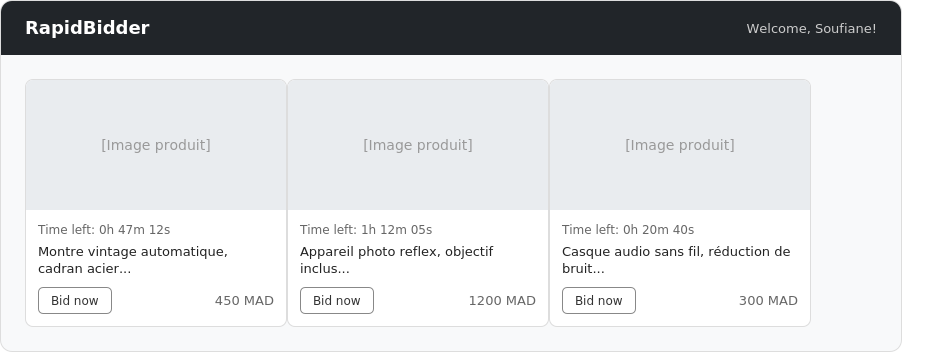
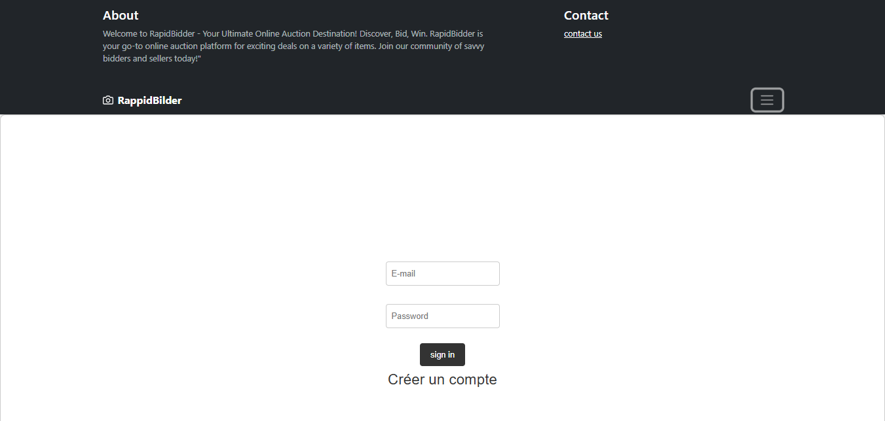
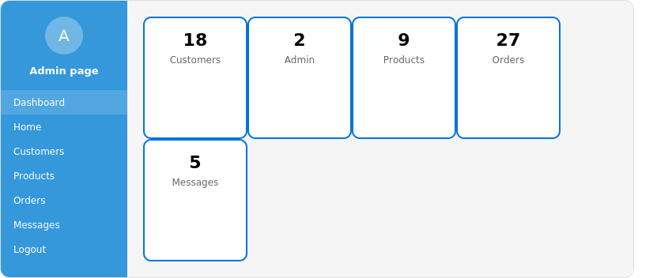

# RapidBidder — Plateforme d'enchères en ligne

Application web permettant à des utilisateurs de s'inscrire, consulter des produits mis aux enchères et placer des offres en temps réel, avec un espace d'administration dédié à la gestion des produits, des clients et des messages.

## Fonctionnalités

- **Authentification** — Inscription et connexion pour les clients, avec espace dédié pour l'administrateur.
- **Catalogue de produits** — Affichage des produits disponibles aux enchères avec image, description et prix actuel.
- **Système d'enchères** — Placement d'offres sur un produit avec mise à jour automatique du prix courant en base de données.
- **Compte à rebours** — Calcul et affichage du temps restant avant la fin de chaque enchère.
- **Espace administrateur** — Ajout, modification et suppression de produits, gestion des clients.
- **Messagerie / Contact** — Formulaire de contact et système de messages entre utilisateurs et administration.
- **Paiement** — Interface de paiement suite à une enchère remportée.

## Captures d'écran

| Page d'accueil | Connexion |
|---|---|
|  |  |

Espace admin


## Stack technique

| Côté | Technologies |
|------|-------------|
| Back-end | PHP, PDO / MySQLi |
| Base de données | MySQL (MariaDB) |
| Front-end | HTML, CSS |

## Structure du projet

```
site-d-encheres/
├── accueil.php          # Page d'accueil — liste des produits et enchères
├── admin.php             # Tableau de bord administrateur
├── authentification.php  # Traitement de la connexion
├── connexion.html/php    # Page et logique de connexion
├── addproduct.php        # Ajout d'un produit
├── edit_produit.php      # Modification d'un produit
├── place_bid.php         # Traitement d'une nouvelle enchère
├── clients.php           # Gestion des clients (admin)
├── messages.php          # Messagerie
├── contactus.php         # Formulaire de contact
├── paiement.html/php     # Processus de paiement
├── compte.php            # Compte utilisateur
├── encheres.sql          # Schéma et structure de la base de données
├── styles.css / rapidbidder.css
└── images/                # Ressources visuelles
```

## Installation

### Prérequis
- PHP 8.x
- MySQL / MariaDB
- Un serveur local (XAMPP, WAMP, ou équivalent)

### Étapes

1. Cloner le dépôt
   ```bash
   git clone https://github.com/<ton-username>/site-d-encheres.git
   ```
2. Placer le dossier dans le répertoire de votre serveur local (ex : `htdocs` pour XAMPP)
3. Créer une base de données nommée `encheres` et importer le fichier `encheres.sql` via phpMyAdmin
4. Configurer les identifiants de connexion à la base de données dans `connexion.php`
5. Lancer Apache et MySQL, puis accéder au projet via `http://localhost/site-d-encheres/accueil.php`

## Pistes d'amélioration

- Passage aux requêtes préparées (PDO) sur l'ensemble des fichiers pour prévenir les injections SQL
- Hachage des mots de passe (actuellement stockés en clair)
- Migration vers un système d'enchères en temps réel (WebSocket) plutôt qu'un rechargement de page
- Séparation claire des responsabilités (structure MVC)

## Auteur

**Soufiane EL AMRAOUI**
Étudiant en Master Intelligence Artificielle et Cybersécurité
[LinkedIn](https://www.linkedin.com/in/soufiane-el-amraoui-92868a2a6/) · elamraouisoufiane2@gmail.com
